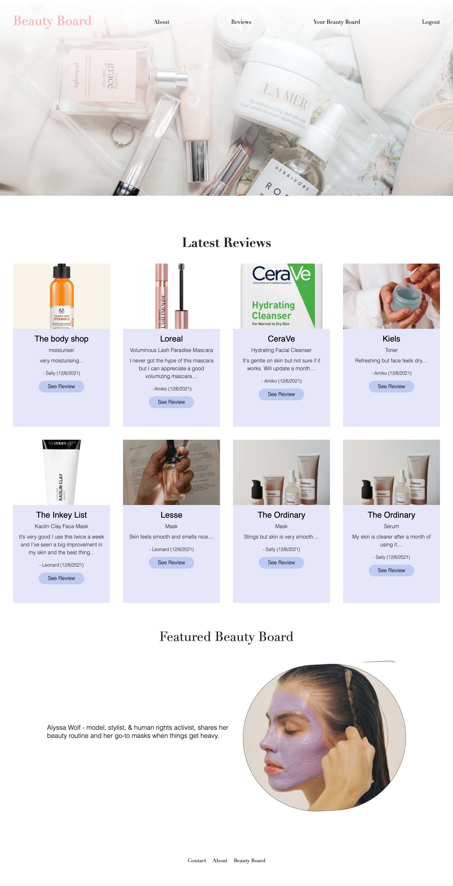
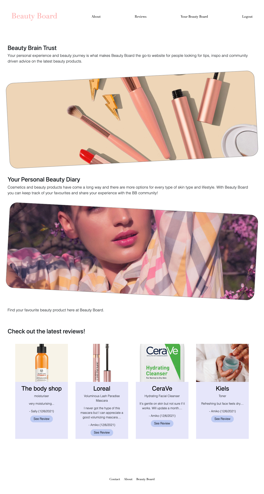
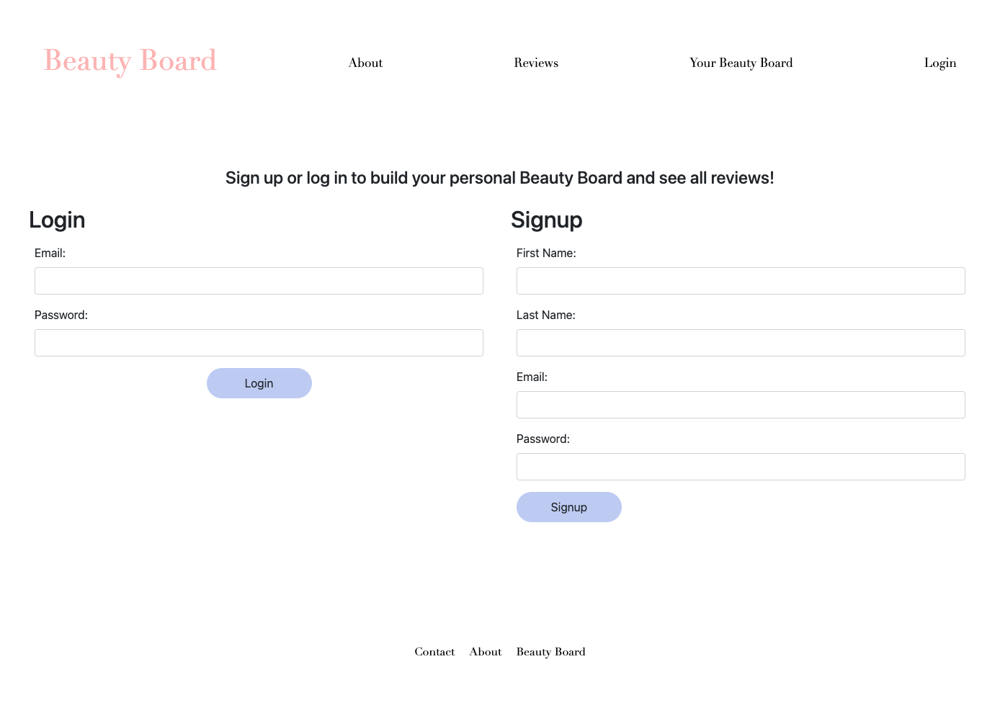
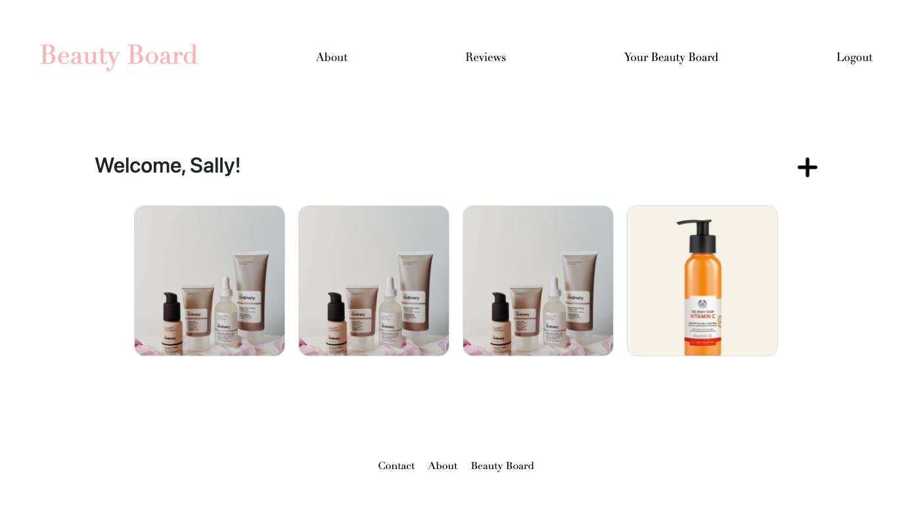
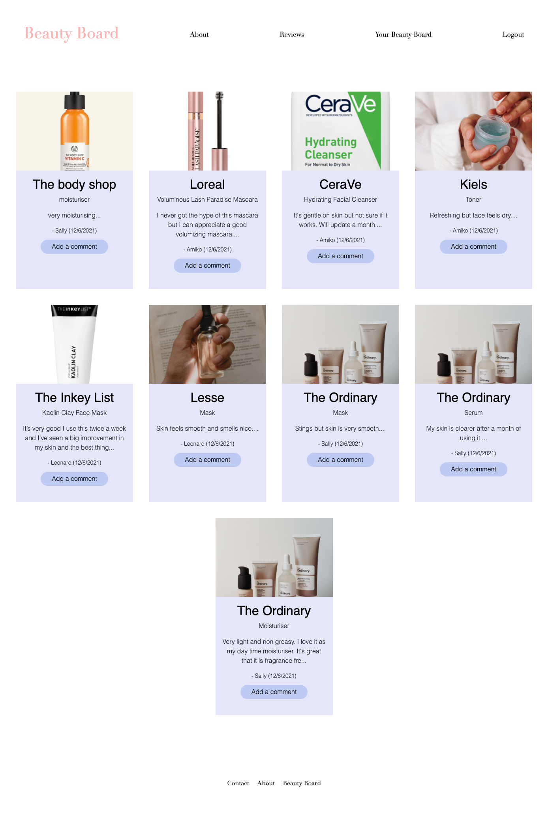

# My Beauty Board

> Beauty Board is a pinterest style website where users can build their own personal board to keep track of beauty products they use and share their experience with other users.
> Live demo [_HERE_](https://mighty-reef-26126.herokuapp.com/). 

## Table of Contents

- [General Info](#general-information)
- [Technologies Used](#technologies-used)
- [Features](#features)
- [Screenshots](#screenshots)
- [Setup](#setup)
- [Usage](#usage)
- [Project Status](#project-status)
- [Room for Improvement](#room-for-improvement)
- [Acknowledgements](#acknowledgements)
- [Contact](#contact)
- [License](#license)

## General Information

The Beauty Industry is growing every day with new, high-quality products for every type of skin type and budget. It can be hard to keep track of all the beauty products that you buy and remember why you bought it in the first place! Beauty Board provides a dashboard for users to save and write notes/reviews on their favourite products and share with the community.

## Technologies Used

- JavaScript
- CSS3
- Bootstrap v5.1
- Node.js
- Express.js
- Express Handlebars
- Express Sessions
- Connect Sessions Sequelize 
- MySQL2
- Sequelize
- Bcrypt
- Dotenv
- Cloudinary

## Features

- Save details of beauty products used in user's dashboard
- Reviews are added to public reviews page and can only be accessed if logged in
- Users can add comments if logged in

## Screenshots







## Setup

This project requires a Cloudinary acccount for the images to be saved and rendered with the widget. Refer to the [Cloudinary](https://cloudinary.com/documentation/upload_widget#crop_and_folder) documentation for more info. 

This project requires Node.js and MySQL to be installed.

Once project has been cloned, run the following in the command line to install the project dependencies - Sequelize, MySQL2, Express.js, Express Handlbars, Express Sessions, Connect Sessions Sequelize, Bcrypt and Dotenv:

```
npm install
```

When dependencies have been installed, set up your environment variables in the .env.EXAMPLE file with your MySQL user and password. Remember to remove ".EXAMPLE" from the file name before continuing.

Next create your database by entering the following commands:

```
mysql -u root -p
```

Enter your MySQL password when prompted. Set up your database with the following command:

```
SOURCE db/schema.sql;
```

Check that your beautyboard_db database has been created by using the following command:

```
SHOW DATABASES;
```

Once the database has been created, exit the MySQL command line.

## Usage

Set up test seeds for the database by executing:

```
npm run seed

or

node seeds/seed.js
```

Enter the following to run the application and start the local server:

```
npm start

or

node server.js
```

## Project Status

Project is: _in progress_

## Room for Improvement

Room for improvement:

- Content flow and UX
- Design elements for reviews and board
- Ability to filter review by product or type

To do:

- Ability to update and delete pins
- Add blog section for featured reviews/writers/influencers
- Add form to add user's skin type, level and preference to be displayed in their dashboard/profile
- Profile and featured pin boards to share a regime
- Share button for reviews/products
- Add rating system
- Add tags to new review form so that reviews can be grouped together for the same product


## Acknowledgements

- Placeholder images by [Unsplash](https://unsplash.com/).

## Contact

Created by [@LexMastro](https://github.com/LexMastro), [@lilyso](https://github.com/lilyso), [@lills1](https://github.com/lills1) - feel free to contact us!

## License
This project is open source and available under the [MIT License](LICENSE).
